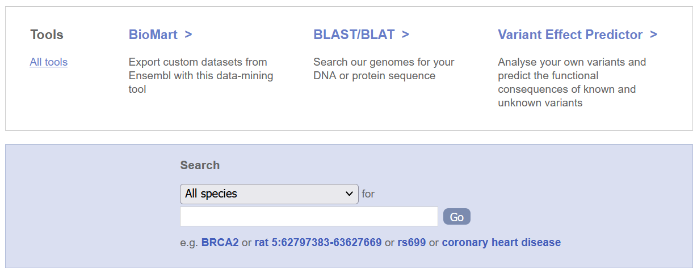
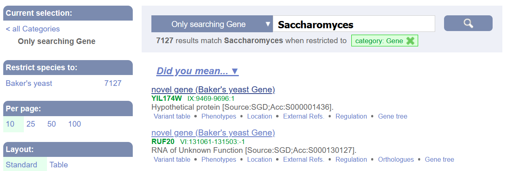
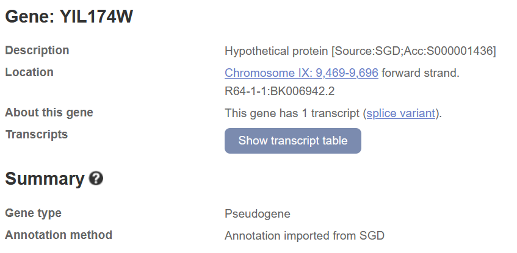
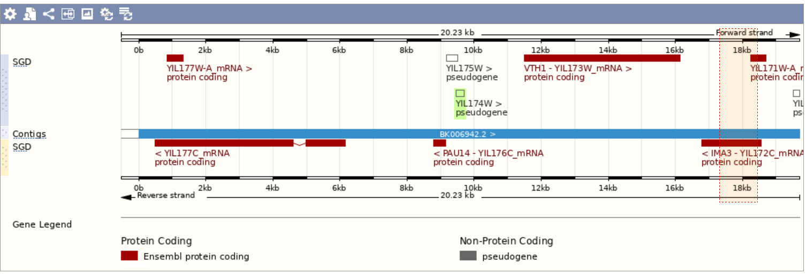
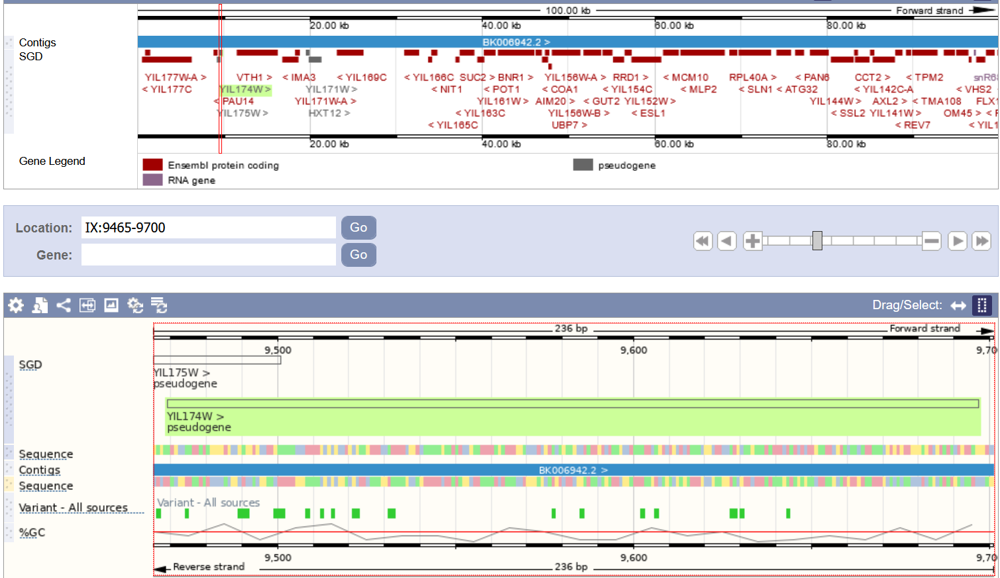
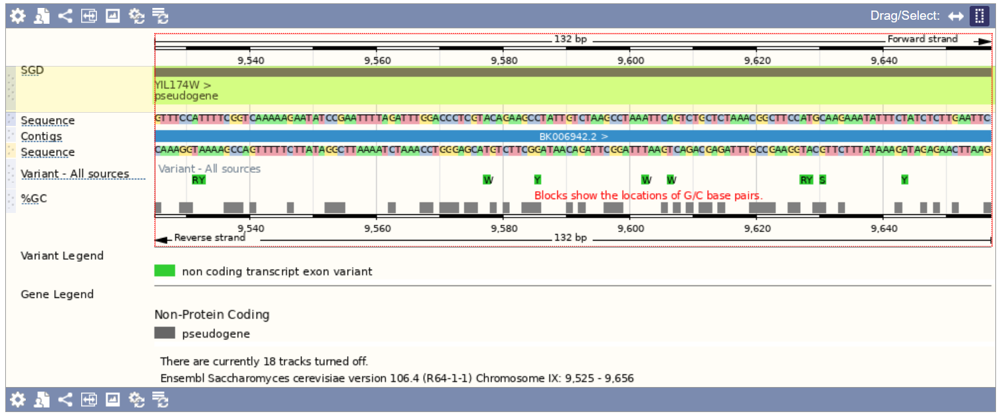
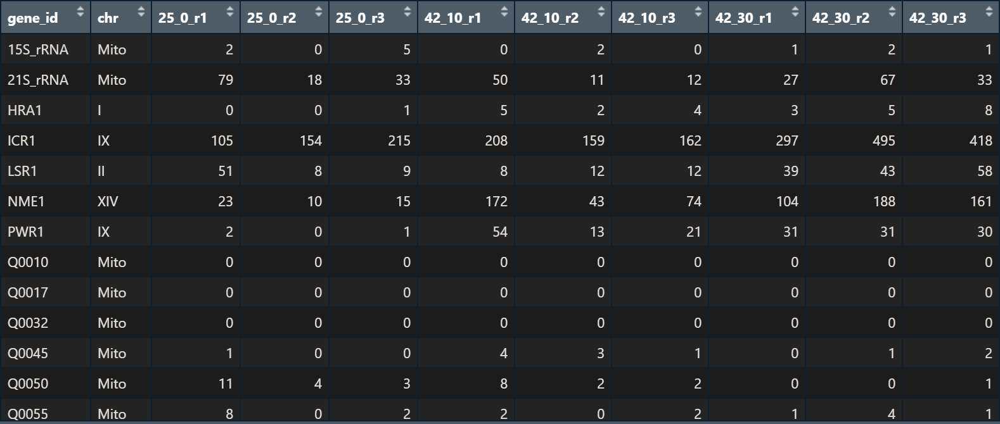

```{r setup, include=FALSE}
knitr::opts_chunk$set(echo = FALSE)
```

## Life with 6000 Genes -- Databases

Internet addresses mentioned in the paper:

-	ftp.mips.embnet.org -> The webiste is online, but without significant content except for ads
-	ftp.ebi.ac.uk -> Website is online and actively used (not the yeast part of it) but for me nothing wants to load on the page
-	genome-ftp.standford.edu -> Webiste ist offline
-	mips.biochem.mpg.de/yeast -> Webiste ist offline
-	sanger.ac.uk/yeast -> website online, but only data about yeast is under: sanger.ac.uk/data/yeast-data/

## Life with 6000 Genes -- Databases

-	genome.stanford.edu/Saccharomycotina -> standford.edu website is  online, but genome.Stanford.edu is offline
-	expasy.hcuge.ch -> offline, but expasy still online
-	proteome.com -> offline
-	Ncbi.nlm.nih.gov -> online and actively used


## Databases for Genes, Proteins and Genomes

- ncbi.nlm.nih.gov (Library of Medicine --- National Center for Biotechnology Information)
- ensembl.org
- ftp.ebi.ac.uk

## ensembl.org

```{r graphica, echo=FALSE, fig.cap="", out.width = '100%'}

```
## ensembl.org

```{r graphicb, echo=FALSE, fig.cap="", out.width = '100%'}

```

## ensembl.org

```{r graphicc, echo=FALSE, fig.cap="", out.width = '100%'}

```

## ensembl.org

```{r graphicd, echo=FALSE, fig.cap="", out.width = '100%'}

```

## ensembl.org

```{r graphice, echo=FALSE, fig.cap="", out.width = '100%'}

```

## ensembl.org

```{r graphicf, echo=FALSE, fig.cap="", out.width = '100%'}

```

## ensembl.org

```{r graphicg, echo=FALSE, fig.cap="", out.width = '100%'}

```

## ensembl.org

```{r graphich, echo=FALSE, fig.cap="", out.width = '100%'}
knitr::include_graphics("scs8.png")
```

## basic yeast heatshock

```{r graphici, echo=FALSE, fig.cap="format of data", out.width = '100%'}

```

Three measurements were made at each temperature, r1, r2 and r3 respectively. They were performed for every different gene section (geneId) in the yeast gene.


## Plot the data

hist(log2(basic_yeast_heatshock$`25_0_r1`))

Problem:
Error in plot.new() : figure margins too large
Solution:

par(mar = c(1, 1, 1, 1))
"hist(log2(basic_yeast_heatshock$`25_0_r1`))"
```{r, echo=FALSE, fig.cap="", out.width = '100%'}
knitr::include_graphics("log2(25_0_r1).png")
```

## Plot the data

`25_0_r1` <- basic_yeast_heatshock$`25_0_r1`
par(mar = c(1, 1, 1, 1))
hist(`25_0_r1`)
```{r, echo=FALSE, fig.cap="Ohne Logarithmus:", out.width = '100%'}
knitr::include_graphics("25_0_r1.png")
```

## Plot the Data
```{r, echo=FALSE, fig.cap=" Mit Logarithmus: hist(log2(`25_0_r1`))", out.width = '100%'}
knitr::include_graphics("log2(25_0_r1).png")
```
Why is the data so different after the log-transformation?
log(0) doesn't exist, 

